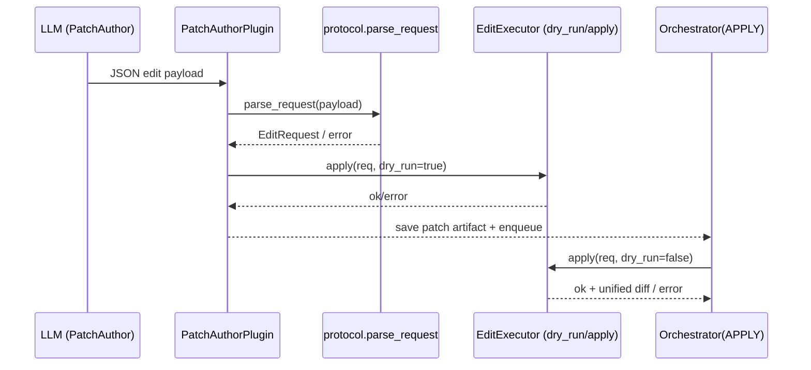
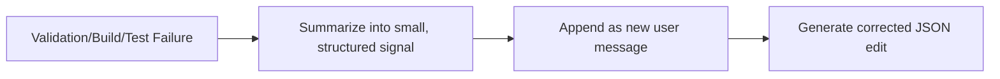

# AgentCli Developer README

> 这是一份**面向开发者/维护者/Agent 开发者**的 README：讲清楚 AgentCli **内部如何工作**、**为什么这样设计**、以及如何在真实仓库里**稳定地生成/校验/应用修改并完成 build/test 闭环**。

---

## 1. Project Overview

AgentCli 解决的问题：在本地仓库中，把“理解代码 → 生成修改 → 应用修改 → 构建 → 测试 → 反馈纠错”做成一个**可重复、可审计、可回放**的 CLI 闭环，尤其适用于 C/C++ 工程（`make -j` + `make test` / gtest 风格输出）。

与“朴素 LLM 写代码”/“直接吐 diff 然后 git apply”的区别：

- **不是代码生成器**：AgentCli 的核心是“在已有代码上做**确定性变换**”，并通过 build/test 验证结果。
- **不是裸 diff 驱动**：当前默认使用**结构化编辑协议**（`old_string/new_string/expected_replacements`），避免 `git apply` 由于上下文漂移、路径不匹配、换行差异等导致的脆弱失败。
- **强调可验证与可回放**：每次 run 都落盘保存计划、上下文、补丁/编辑指令、校验日志与 transcript，便于复现与 debug。

核心设计目标（工程共识）：

- **deterministic**：同一输入/上下文下，编辑行为可预测；
- **verifiable**：每次修改必须能通过 build/test（或明确失败并产生结构化诊断）；
- **replayable**：run 产物齐全，可复盘每一步发生了什么。

---

## 2. High-Level Architecture

AgentCli 以“流水线 pipeline + 分阶段 stage”的方式执行：

- **PREPARE**：环境决策（是否用 WSL、是否 fallback）
- **GATHER**：RepoScout 搜索上下文
- **EDIT**：PatchAuthorPlugin 调用 LLM 生成“编辑指令 JSON”
- **APPLY**：EditExecutor 强校验并原子写入文件
- **VERIFY_BUILD**：执行 build 并解析错误
- **VERIFY_TEST**：执行 test 并解析失败用例
- **FEEDBACK**：把校验错误/构建错误/测试失败摘要回灌给 EDIT，进入下一轮迭代

Mermaid（端到端闭环）：

```mermaid
flowchart TD
    User[User Task] --> CLI[agent.py / agent.cli]
    CLI --> Orch[agent.orchestrator.Orchestrator]

    Orch --> Prepare[PREPARE: EnvAgentPlugin]
    Prepare --> Gather[GATHER: RepoScoutPlugin]
    Gather --> Edit[EDIT: PatchAuthorPlugin + LLMService]
    Edit --> VerifyJSON[Protocol parse + dry-run validation]
    VerifyJSON --> Apply[APPLY: EditExecutor (atomic)]
    Apply --> Build[VERIFY_BUILD: BuildPlugin]
    Build --> Test[VERIFY_TEST: TestPlugin + TestTriage]

    Test -->|pass| Done[FINALIZE]
    Test -->|fail| Feedback[FEEDBACK: summarize errors -> next iteration]
    Build -->|fail| Feedback
    VerifyJSON -->|fail| Feedback
    Feedback --> Edit
```

代码对应关系（入口到核心模块）：

- CLI 入口：`agent.py` → `agent/cli.py`
- 编排器：`agent/orchestrator.py`
- 框架层（插件化流水线）：`agent/framework/*`
- Agent 插件（各 stage 实现）：`agent/agents/*`
- 确定性编辑协议与执行器：`agent/editing/{protocol.py,executor.py}`
- 工具调用封装：`agent/tool_router.py`
- LLM 抽象：`agent/llm/*`

---

## 3. Core Design Principles

### 3.1 为什么用 structured edits，而不是 raw diffs

真实工程里，裸 diff 失败常见原因包括：

- 路径不一致（LLM 输出 `a/foo.c`，真实在 `demo_c_project/src/foo.c`）
- 上下文不匹配（LLM “美化格式/补空行”导致 context 行不一致）
- CRLF/LF 差异、空格差异、补丁上下文太短等

结构化编辑（`old_string -> new_string`）的优点：

- **锚点是你指定的字符串**，不是 git 的模糊匹配；
- 通过 `expected_replacements` 做强约束，避免“错替换/替换多处”的隐性灾难；
- 可在工具侧实现**强校验、原子执行、生成统一 diff 作为审计输出**。

> 注：历史上你可能见过 `search_block/replace_block` 这类命名；在当前实现里，它等价于 `old_string/new_string`。核心要求一致：**必须 byte-for-byte 精确匹配**。

### 3.2 为什么强调 byte-for-byte exact（old_string 必须逐字节匹配）

这不是“苛刻”，而是为了：

- **Fail fast**：找不到锚点就立刻失败，不允许“猜着改”；
- **No guess edits**：不依赖 LLM 对代码格式的主观重排；
- **可重复**：相同文件内容下，替换行为确定。

### 3.3 这套设计与 Cursor / Claude Code 的一致性

现代 agent coding 系统的稳定性，来自：

- **结构化输出协议**（可被程序验证）
- **工具侧强校验**（guard/validator）
- **反馈回路**（把失败信号精炼成下一轮提示）

AgentCli 把这些原则固化到可运行的 pipeline 中。

---

## 4. Prompt Engineering Strategy

PatchAuthorPlugin 使用“强约束 System Prompt + 明确文件边界的 User Prompt”来减少幻觉与不可应用编辑。

关键点：

- **禁止 Markdown**：避免模型输出 ```json fences 或额外解释文本导致 JSON 解析失败
- **强制严格 JSON**：必须是“单个 JSON object”，便于协议解析与错误定位
- **强制 exact match**：old_string 必须来自提供的文件内容（不允许重排/美化）
- **强制 occurrences**：old_string 出现次数必须等于 expected_replacements

简化示例（片段，非完整 prompt dump）：

```text
System: You are an Automated Code Refactoring Engine...
Rules:
 - Output RAW JSON only (no markdown)
 - old_string must be byte-for-byte identical to the file content
 - old_string occurrences must equal expected_replacements

User:
 Task: ...
 --- FILE: demo_c_project/src/calculator.c ---
 (真实文件内容...)
 --- END OF demo_c_project/src/calculator.c ---
 Output the JSON object now:
```

---

## 5. Patch Schema & Edit Model

AgentCli 当前默认“补丁”格式是 **File Editing Protocol**（见 `agent/editing/protocol.py`）。

Schema（示例）：

```json
{
  "action": "edit",
  "file_path": "demo_c_project/src/calculator.c",
  "edits": [
    {
      "old_string": "int add(int a, int b) { return a + b; }\n",
      "new_string": "int add(int a, int b) { return a + b; }\nint mul(int a,int b){return a*b;}\n",
      "expected_replacements": 1
    }
  ],
  "message": "add calculator mul and keep minimal changes"
}
```

字段语义：

- `action`
  - `edit`：顺序应用 `edits[]`（每条替换都必须通过 occurrences 校验）
  - `multi_edit`：工具侧先**预校验全部 edits**，然后一次性落盘（all-or-nothing）
- `file_path`：**只允许一个文件**（当前 pipeline 假设一次 EDIT 只改一个文件更稳定）
- `edits[]`
  - `old_string`：确定性锚点（必须与文件内容逐字节一致）
  - `new_string`：替换后的内容
  - `expected_replacements`：期望替换次数（强一致性约束）
- `message`：可选说明（用于 transcript/审计，不参与执行）

为什么偏好最小变更：

- 降低锚点漂移概率
- 降低重复替换/冲突概率
- 让 build/test 失败时的定位更直观

---

## 6. Patch Validation & Safety Checks

### 6.1 校验链路（EDIT 阶段预校验 + APPLY 阶段执行）

AgentCli 的核心安全边界在两处：

1) **协议校验**：`agent/editing/protocol.parse_request()`  
2) **执行器校验**：`agent/editing/executor.EditExecutor.apply()`  

其中 PatchAuthorPlugin 在 EDIT 阶段会做一次 **dry-run 预校验**（不写文件）：

- 解析 JSON → 构造 `EditRequest`
- `EditExecutor.apply(req, dry_run=True)`
- 失败则把错误摘要回灌给 LLM（一次重试），仍失败则本轮 EDIT skip

APPLY 阶段才会真正落盘写文件，并生成审计 diff。

Mermaid（校验序列图）：



### 6.2 关键安全检查（当前实现）

- **JSON schema 校验**：必须有 `action/file_path/edits[]/expected_replacements`
- **read-before-edit**：EditExecutor 需要文件内容已加载到 `ctx.file_contents`
  - 由 PatchAuthorPlugin 在构建 prompt 时读文件并缓存
- **occurrences 校验**：`content.count(old_string) == expected_replacements`
- **multi_edit 原子性**：先预校验所有 edits，再一次性写回（all-or-nothing）
- **统一 diff 审计输出**：由 EditExecutor 基于 old/new content 生成 unified diff（上下文 3 行）

> 说明：当前 allowlist 的“硬 enforcement”主要依赖 PatchAuthorPlugin 的 `allowed_files` 约束与 prompt 自检；未来如果需要更强隔离，可在 APPLY 前增加对 `ctx.context_pack` 的严格 allowlist gate。

---

## 7. Build & Test Execution (WSL Strategy)

在 Windows 上，AgentCli 通常用 WSL 来跑 `make`（更贴近真实 Linux 构建环境）：

- 为什么：Windows 默认没有 GNU make；WSL 能提供一致的工具链与路径语义
- 如何执行：通过 `wsl -e bash -lc "cd <wsl_path> && <cmd>"`

示例（demo）：

```bash
wsl -e bash -lc "cd /mnt/d/AgentCli/demo_c_project && make -j"
wsl -e bash -lc "cd /mnt/d/AgentCli/demo_c_project && make test"
```

环境策略由 `agent/env_agent.py` 决策（EnvAgentPlugin 调用）：

- `strategy = wsl_make | gnu_make | nmake | fallback_py | error`
- 输出 `env_decision.commands.build/test`，供 BuildPlugin/TestPlugin 使用

测试注入（demo 专用约定）：

- `demo_c_project/tests/test_calculator.cpp` 默认用 `TEST_SHOULD_FAIL` 故意制造一个失败用例用于 triage
- 为了让 AgentCli 的“默认闭环”可通过，`agent/agents/test_plugin.py` 会在 VERIFY_TEST 阶段（WSL bash -lc 形态）默认注入：
  - `TEST_SHOULD_FAIL=0 make test`

---

## 8. Error Handling & Feedback Loop

常见失败模式：

- **协议错误**：JSON 不是 object、缺字段、expected_replacements 非正整数
- **锚点不匹配**：`old_string` 在文件里找不到（通常是 LLM 改了格式/缩进/换行）
- **锚点不唯一**：出现次数 ≠ expected_replacements（太短/太泛的 old_string）
- **构建失败**：编译错误、链接错误
- **测试失败**：gtest 输出 `[  FAILED  ] ...` 或 report.xml 里 failure
- **LLM 调用失败**：网络/额度/超时（例如 OpenRouter 402）

错误如何被转成“可用的反馈信号”：

- 协议/锚点失败：直接把 validator/executor 的错误摘要回灌给 LLM，并要求只修 `old_string/expected_replacements`
- build/test 失败：把 top errors / failed tests 摘要写入 run 产物，并用于下一轮 EDIT 的提示上下文

Mermaid（失败 → 反馈 → 重试）：



诊断产物位置（每次 run 都会写）：

- `runtime/agent/runs/<run_id>/transcript.json`：事件流（stage/agent start/end、env/build/test 结果等）
- `runtime/agent/runs/<run_id>/verify/*_make.log`：构建日志
- `runtime/agent/runs/<run_id>/verify/*_test.log`：测试日志
- `runtime/agent/runs/<run_id>/patches/001.diff`：编辑指令（JSON）

---

## 9. Extensibility Guide

### 9.1 扩展点总览

AgentCli 的扩展遵循“pipeline + plugin”的结构：

- Stage 枚举：`agent/framework/agent_types.py`
- 注册与执行：
  - `agent/framework/registry.py`（按 stage 注册 plugin）
  - `agent/framework/pipeline.py`（按 stage 执行并发事件）
- 共享上下文：`agent/framework/context.py`（RunContext）

你可以安全扩展：

- **新增 build 策略**：在 `EnvAgent` 里加 detection/decision，或新增一个 PREPARE plugin
- **新增 validator/guard**：在 APPLY 前后插入新的 stage/plugin（例如 POLICY_CHECK）
- **新增 prompt 约束**：只改 `PatchAuthorPlugin._build_prompt()`，并保持协议不变
- **替换/新增 LLM provider**：实现 `agent/llm/providers/base.py` 并在 `LLMService.from_env()` 选择

### 9.2 明确使用的设计模式

- **Pipeline pattern**：stage 顺序执行，清晰边界
- **Strategy pattern**：EnvAgent 在不同环境选择不同 build/test 命令策略
- **Command pattern**：ToolRouter 统一封装外部命令执行与输出截断
- **Guard/Validator pattern**：parse_request + EditExecutor 作为执行前强校验闸门

### 9.3 重要约束（强烈建议遵守）

- 只在 EDIT 阶段（PatchAuthorPlugin）生成“写操作指令”，其他 agent 不直接改 workspace 文件
- 所有外部命令通过 `agent/tool_router.py` 执行（便于统一日志截断与可观测性）
- 任何自动修复都必须能被 build/test 验证，否则视为未完成

---

## 10. Mental Model Summary (For New Contributors)

如果只记住一句话：

> AgentCli 不是代码生成器 —— 它是一个由 LLM 驱动的**确定性代码变换引擎**：输出必须可验证、可审计、可回放，失败必须可定位并可反馈重试。


